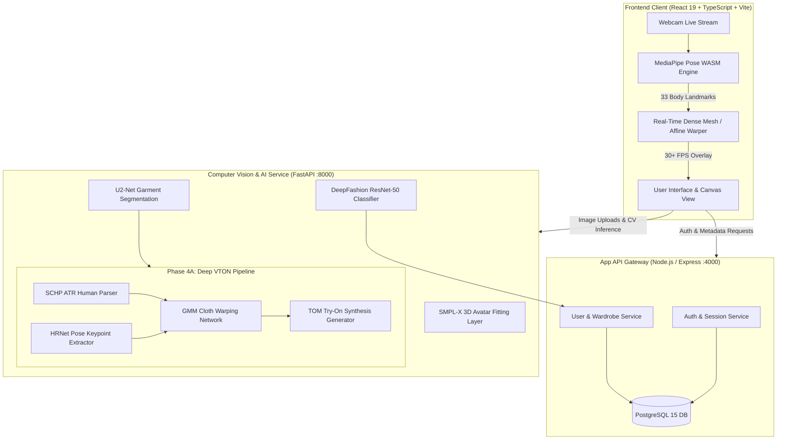

# 👕 V-TryOn — Real-Time AR & Neural T-Shirt Virtual Try-On Platform

<div align="center">


**An enterprise-grade, dual-engine Virtual Try-On platform delivering ultra-low-latency real-time AR T-shirt fitting alongside photorealistic 2D/3D deep-learning neural garment draping.**

[Overview](#-overview) • [Portfolio Highlights](#-portfolio--resume-highlights) • [Architecture](#-system-architecture) • [Features](#-key-features) • [Tech Stack](#-technology-stack) • [Quickstart](#-getting-started) • [API Docs](#-api-reference) • [Roadmap](#-roadmap--milestones) • [Resume Bullet Points](#-resume-bullet-points)

</div>

---

## 📌 Project Status: 70% Completed (Ongoing / Active Development)

> [!NOTE]
> **Milestone Status: 🟡 Phase 4A Complete · Phase 4B & 5 Active Development**
> - **Completed Phases (1–4A):** Core microservice framework, database models, client-side real-time AR try-on (MediaPipe WASM + dynamic mesh warp @ 30+ FPS), U2-Net automatic cloth matting, DeepFashion ResNet-50 classification, and isolated CP-VTON+ (SCHP human parsing + HRNet pose estimation + GMM/TOM) neural inference pipeline.
> - **In Progress (Phase 4B & 5):** Parametric 3D body estimation via SMPL-X and Three.js WebGL rendering for 3D physics-based avatar cloth draping.

```
Total Project Progress: [████████████████████████░░░░░░░░] 70%
━━━━━━━━━━━━━━━━━━━━━━━━━━━━━━━━━━━━━━━━━━━━━━━━━━━━━━━━━━━━━━━━━━
[Phase 1] Auth & Foundation Architecture      │ [██████████] 100% (DONE)
[Phase 2] Real-Time AR Engine (MediaPipe)     │ [██████████] 100% (DONE)
[Phase 3] Garment Processing & Classification │ [██████████] 100% (DONE)
[Phase 4A] Deep Learning VTON Pipeline        │ [██████████] 100% (DONE)
[Phase 4B] SMPL-X 3D Body Scanning & Avatars  │ [████░░░░░░]  40% (ACTIVE)
[Phase 5] Three.js Cloth Draping & 3D WebGL   │ [██░░░░░░░░]  20% (IN PROGRESS)
[Phase 6] Cloud Deployment & GPU Scaling      │ [░░░░░░░░░░]   0% (ROADMAP)
```

---

## 🌟 Portfolio & Resume Highlights

Built for high performance, scalability, and modular computer vision pipelines:

- **Dual-Engine Architecture:** Combines client-side zero-latency real-time AR fitting (60 FPS pose tracking via WebAssembly) with asynchronous high-fidelity deep neural network try-on (CP-VTON+ & U-Net).
- **End-to-End Deep Learning CV Pipeline:** Integrates **Self-Correction Human Parsing (SCHP ATR)**, **HRNet-W32 pose estimation**, **Geometric Matching Module (GMM)** for cloth warping, and a **Try-On Module (TOM)** generator.
- **Garment Intelligence & Classification:** Deployed a **ResNet-50** deep classifier trained on **DeepFashion** to classify apparel into 50 categories with top-5 ranked confidence intervals.
- **Automated Preprocessing & Matting:** Embedded **U2-Net saliency segmentation** for sub-second automated background elimination on user-uploaded clothing flat-lays.
- **Production-Ready Containerized Microservices:** Fully decoupled **React 19 + Vite frontend**, **Node.js/Express application API gateway**, and **FastAPI PyTorch GPU inference engine**, orchestrated via **Docker Compose**.

---

## 🏛️ System Architecture



---

## ⚡ Key Features

### 1. 🎥 Real-Time In-Browser AR Fitting
- Employs **MediaPipe Pose (WASM)** client-side tracking to capture 33 3D skeletal landmarks directly from webcam feeds without server round-trip latency.
- Dynamically computes shoulder-to-hip bounding vectors, perspective tilt, and torso deformations using custom affine and dense mesh warping algorithms (`drawDenseWarp`) on HTML5 2D Canvas.

### 2. 🧠 Neural Virtual Try-On Pipeline (CP-VTON+)
- **Human Parsing:** Extracts fine-grained 18-class semantic masks (face, hair, arms, torso, legs, shoes) using **SCHP ATR**.
- **Pose Extraction:** Computes COCO-format 18-keypoint coordinate maps via **HRNet-W32 (256x192)**.
- **Cloth Deformation:** Utilizes **Thin-Plate Spline (TPS)** transformation driven by the **Geometric Matching Module (GMM)** to deform the garment to match target human geometry.
- **Photorealistic Blending:** Generates realistic folds, lighting, and garment seams via the **Try-On Module (TOM)**.

### 3. ✂️ Automated Garment Matting & Segmentation
- Strips backgrounds and isolations from uploaded e-commerce or flat-lay garment images instantly using an integrated **U2-Net / rembg** background removal service.

### 4. 🏷️ DeepFashion Attribute & Category Classifier
- Real-time classification of clothing items into 50 fine-grained categories with **ResNet-50**, returning top-5 probabilities and feature vectors for wardrobe categorization.

### 5. 👤 3D Avatar Body Reconstruction (SMPL-X)
- Parametric 3D human body estimation framework prepared to convert 2D measurements into fitted `.glb` 3D avatars for WebGL rendering in **Three.js**.

---

## 🛠️ Technology Stack

| Layer | Technologies | Purpose |
| :--- | :--- | :--- |
| **Frontend** | React 19, TypeScript, Vite, HTML5 Canvas, MediaPipe Pose WASM | Ultra-fast UI, camera processing & client-side AR warping |
| **CV / AI Backend** | FastAPI, Python 3.10+, PyTorch 2.2, torchvision, OpenCV, rembg | High-throughput computer vision inference and model serving |
| **Machine Learning** | CP-VTON+ (GMM + TOM), SCHP ATR, HRNet-W32, ResNet-50, U-Net, SMPL-X | Human parsing, pose detection, garment warping & classification |
| **Application Backend** | Node.js, Express 5, TypeScript, ts-node, JWT, bcrypt | User authentication, session management, wardrobe CRUD |
| **Database** | PostgreSQL 15, Prisma ORM | Relational user data, garment metadata, and avatar storage |
| **DevOps & Tooling** | Docker, Docker Compose, PowerShell automated setups, ESLint | Containerization, environment isolation & reproducible builds |

---

## 📂 Repository Structure

```text
Virtual-Try-On/
├── backend/
│   ├── app/                          # Node.js / Express Application Gateway
│   │   ├── server.ts                 # REST API routes (Auth, Users, Avatars)
│   │   ├── Dockerfile                # Docker container definition
│   │   └── package.json              # Express dependencies
│   └── cv/                           # FastAPI Computer Vision Engine
│       ├── main.py                   # FastAPI endpoints (Segmentation, Try-on, Classification)
│       ├── unet_model.py             # Custom PyTorch U-Net architecture
│       ├── requirements.txt          # Python CV dependencies
│       └── vton/                     # Isolated Neural VTON Pipeline (Phase 4A)
│           ├── parsers/              # SCHP Human Parsing modules
│           ├── pose/                 # HRNet 2D Pose Estimation
│           ├── cpvton/               # CP-VTON+ (GMM + TOM) neural networks
│           ├── checkpoints/          # Model weights (SCHP, HRNet, GMM, TOM)
│           ├── samples/              # Input person & garment test images
│           ├── outputs/              # Generated intermediate & final artifacts
│           ├── scripts/              # Environment setup & PowerShell scripts
│           └── vton_pipeline.py      # Unified inference orchestrator
├── frontend/                         # React 19 + TypeScript + Vite Single Page App
│   ├── src/
│   │   ├── App.tsx                   # Live webcam AR try-on interface & controls
│   │   ├── warpUtils.ts              # Mathematical mesh and affine warping functions
│   │   └── index.css                 # Premium dark-mode styling & HUD overlays
│   ├── public/                       # Static assets and sample garments
│   └── package.json                  # Frontend dependencies
├── ml/                               # Machine Learning Training & Notebooks
│   ├── VITON_Training/               # VITON / UNet training scripts & weights
│   ├── train_deepfashion.ipynb       # DeepFashion ResNet-50 training notebook
│   └── class_to_idx.json             # 50 DeepFashion class index mappings
├── docker-compose.yml                # Multi-container orchestration (DB, App, CV)
├── test_pipeline.py                  # CLI test runner for Phase 4A VTON pipeline
├── debug_pipeline.py                 # Verbose pipeline debugger with error diagnostics
└── plan.txt                          # Comprehensive 6-Phase technical architecture roadmap
```

---

## 🚀 Getting Started

### Prerequisites
- **Node.js**: `v18+` or `v20+`
- **Python**: `3.10+` with CUDA support (optional, CPU supported)
- **Docker & Docker Compose**: Recommended for full-stack deployment
- **Git**: For version control

---

### Option A: Complete Stack via Docker Compose (Recommended)

Run the database, application gateway, and CV backend in a single command:

```bash
# Clone the repository
git clone https://github.com/prathmesh-nitnaware/Virtual-Try-On.git
cd Virtual-Try-On

# Launch all microservices
docker-compose up --build
```

Services will be accessible at:
- **FastAPI CV Engine:** `http://localhost:8000` (Swagger UI: `http://localhost:8000/docs`)
- **Express App Backend:** `http://localhost:4000`
- **PostgreSQL Database:** `localhost:5432`

---

### Option B: Local Microservices Setup

#### 1. Start the FastAPI CV Backend
```bash
cd backend/cv
python -m venv venv
# Windows:
.\venv\Scripts\activate
# Linux/macOS:
# source venv/bin/activate

pip install -r requirements.txt
python main.py
```

#### 2. Start the Express App Backend
```bash
cd backend/app
npm install
npm run dev
```

#### 3. Start the React Frontend
```bash
cd frontend
npm install
npm run dev
```
Open `http://localhost:5173` in your browser to test the real-time AR try-on.

---

### Option C: Running the Isolated AI VTON Pipeline (Phase 4A)

To execute the offline high-resolution neural try-on pipeline with pretrained checkpoints:

```powershell
# 1. Setup the dedicated virtual environment
powershell -ExecutionPolicy Bypass -File "backend/cv/vton/scripts/setup_vton_env.ps1"

# 2. Place model checkpoints in backend/cv/vton/checkpoints/:
# - human_parsing/exp-schp-201908301523-atr.pth
# - pose/pose_hrnet_w32_256x192.pth
# - vton/gmm_final.pth
# - vton/tom_final.pth

# 3. Add test images in backend/cv/vton/samples/person.jpg & garment.jpg

# 4. Execute test run
python test_pipeline.py

# Or run with full verbose diagnostics
python debug_pipeline.py
```

Output artifacts (`warped_cloth.png`, `parsing_mask.png`, `pose_overlay.png`, `result.png`) will be generated in `backend/cv/vton/outputs/`.

---

## 📡 API Reference

### Computer Vision Service (`:8000`)

| Method | Endpoint | Content-Type | Description |
| :--- | :--- | :--- | :--- |
| `GET` | `/health` | `application/json` | CV backend health check |
| `POST` | `/api/cv/segment-garment` | `multipart/form-data` | Removes background from uploaded garment using U2-Net |
| `POST` | `/api/cv/classify-garment` | `multipart/form-data` | Predicts apparel category with top-5 confidences via ResNet-50 |
| `POST` | `/api/cv/try-on` | `multipart/form-data` | Generates 2D neural try-on image from clothing + person photos |
| `POST` | `/api/cv/smpl-estimate` | `application/json` | SMPL-X parametric 3D body estimation endpoint |

### Application Gateway (`:4000`)

| Method | Endpoint | Description |
| :--- | :--- | :--- |
| `GET` | `/health` | Application backend health check |
| `POST` | `/api/auth/register` | User registration and account provisioning |
| `POST` | `/api/auth/login` | User authentication returning JWT session token |
| `GET` | `/api/users/:userId/avatar` | Retrieves 3D avatar & body measurement records |

---

## 🗺️ Roadmap & Milestones

- [x] **Phase 1: Project Foundation & Architecture**
  - [x] Microservice boundaries & Docker Compose setup
  - [x] RESTful API contracts & health monitoring
- [x] **Phase 2: Client-Side Real-Time AR Engine**
  - [x] MediaPipe Pose integration in React 19 + TypeScript
  - [x] Interactive calibration controls (fit scale, offset Y, real-time FPS counter)
  - [x] Dense mathematical mesh warping algorithm (`warpUtils.ts`)
- [x] **Phase 3: Garment Intelligence & Image Processing**
  - [x] Automated background removal using U2-Net (`/api/cv/segment-garment`)
  - [x] DeepFashion ResNet-50 classifier training & inference pipeline
- [x] **Phase 4A: Isolated Deep Learning VTON Pipeline**
  - [x] SCHP ATR human parsing model integration
  - [x] HRNet 18-keypoint body pose estimator
  - [x] CP-VTON+ Geometric Matching Module (GMM) and Try-On Module (TOM)
  - [x] Automated test suite & debug scripts (`test_pipeline.py`, `debug_pipeline.py`)
- [ ] **Phase 4B: SMPL-X 3D Body Scan & Mesh Fitting** *(In Progress)*
  - [ ] Multi-angle webcam body landmark extraction
  - [ ] SMPL-X parametric mesh generation and body measurement calculation
- [ ] **Phase 5: 3D WebGL Avatar Cloth Draping & Three.js Engine** *(Upcoming)*
  - [ ] 3D avatar rendering with custom shaders in Three.js
  - [ ] UV texture mapping & physics-based cloth deformation
- [ ] **Phase 6: Production Polish, Cloud Deployment & Benchmarking** *(Upcoming)*
  - [ ] AWS S3 / Cloudflare R2 asset storage integration
  - [ ] GPU-accelerated inference deployment (Triton / TorchServe)

---

## 💼 Resume Bullet Points

> *Feel free to use these tailored STAR-method bullet points for your resume, CV, or portfolio showcase:*

### Option 1: Computer Vision / AI & ML Engineer
- **Engineered an end-to-end Deep Virtual Try-On (VTON) pipeline** in PyTorch integrating **SCHP Human Parsing**, **HRNet Pose Estimation**, and **CP-VTON+ (GMM + TOM)** to generate photorealistic neural garment draping.
- **Built an intelligent clothing classification and segmentation service** using **ResNet-50** on the **DeepFashion** dataset (50 classes, top-5 confidence ranking) and **U2-Net** for sub-second background removal.
- **Formulated a dual-engine architecture** combining zero-latency client-side AR fitting with high-fidelity server-side neural rendering, containerized with **FastAPI** and **Docker Compose**.

### Option 2: Full-Stack / Software Engineer
- **Developed a high-performance Virtual Try-On web platform** leveraging **React 19**, **TypeScript**, and **MediaPipe Pose WASM** to perform 30+ FPS real-time mesh warping on live webcam feeds.
- **Architected a scalable microservice system** separating a **Node.js/Express** authentication gateway with **PostgreSQL 15** from a high-throughput **FastAPI** computer vision engine.
- **Automated deployment and testing workflows** using **Docker Compose** and custom diagnostic scripts, reducing local environment onboarding time to under 5 minutes.

---

## 👥 Authors & Acknowledgments

- **Lead Developer:** [Prathmesh Nitnaware](https://github.com/prathmesh-nitnaware)
- **Datasets & Pretrained Models:**
  - [SCHP (Self-Correction Human Parsing)](https://github.com/GoGoDuck912/Self-Correction-Human-Parsing)
  - [HRNet (High-Resolution Network)](https://github.com/leoxiaobin/deep-high-resolution-net.pytorch)
  - [CP-VTON+ (Characteristic-Preserving Virtual Try-On Network)](https://github.com/minar09/cp-vton-plus)
  - [DeepFashion Dataset](http://mmlab.ie.cuhk.edu.hk/projects/DeepFashion.html)

---

<div align="center">
  <sub>Built with ❤️ for real-time computer vision and neural fashion synthesis.</sub>
</div>
